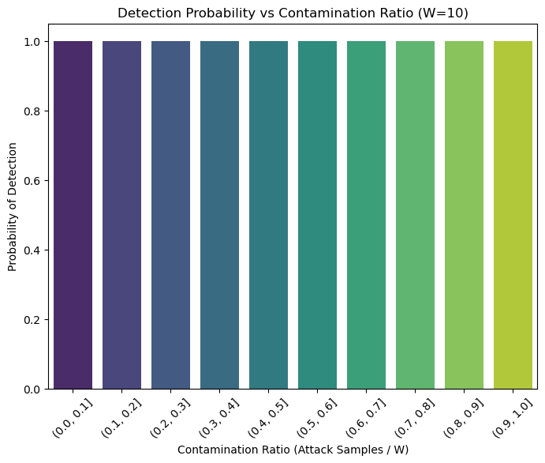
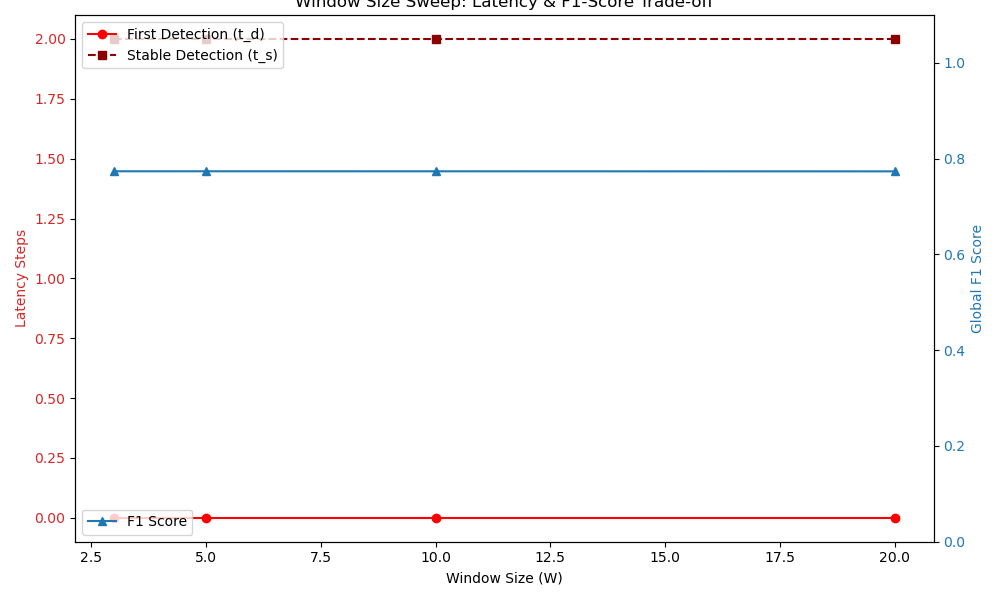

# Phase 3 Trade-off Sweep Validation

We evaluate the robustness of a fixed trained model under varying temporal aggregation scales (window sizes) without retraining or threshold adjustment.

> **To isolate the impact of temporal aggregation, we maintain a fixed model and decision threshold while varying the sliding window size, ensuring that observed performance differences arise solely from changes in temporal context.**

## Detection vs Contamination

**Key Finding:** Detection occurs before full contamination of the observation window, indicating sensitivity to early-stage interference patterns.

## Latency and Stability Trade-off

By mapping the stability definition $t_s = \min\{t \mid \hat{y}(t), \dots, \hat{y}(t+K) > \theta\}$ we clearly identify how greater window sizes delay immediate latency but significantly raise F1 thresholds by smoothing noise.